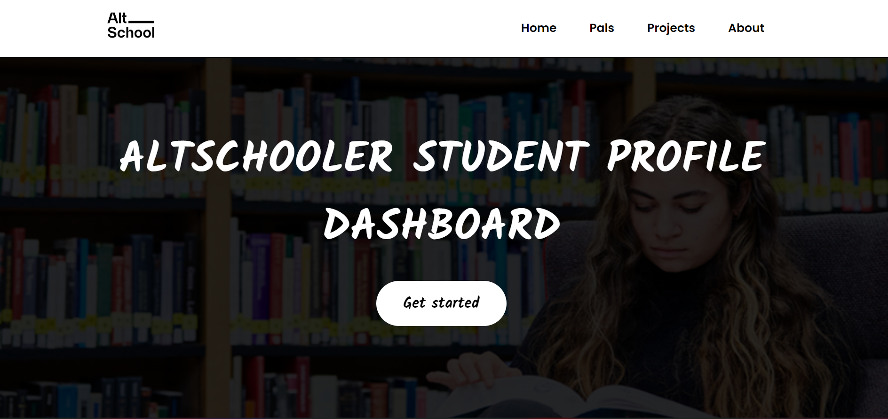

# AltSchool Africa Student Profile Dashboard
Open-source stands for being transparent, sharing, and contributing to others’ projects to improve them or to modify them for your own. In any case, the essence of open-source is a large community of contributors. Please help us make this a massive project by contributing. You can also read through this file to learn how to make your contribution count. 


GRACIAS

<br>
<br>
<br>


## NOTE:
You don’t have to become a lifelong contributor to enjoy participating in open source. Have you ever seen a typo on a website, and wished someone would fix it? On an open source project, you can do just that. Open source helps people feel agency over their lives and how they experience the world, and that in itself is gratifying.


<br>
<br>


### BELOW IS THE LINK TO THE WEBSITE
# [Cloudlord-and-pals](https://cloudlord-and-pals.netlify.app/)



<br>
<br>
<br>


## Steps On How To Contribute
- Fork the project repository into your github account

- Click the green Clone button and then copy the HTTPS URL

- Using Git on your local machine, clone your fork using the URL you just copied i.e git clone THE URL YOU FORKED INTO YOUR ACCOUNT

-  Navigate to your local repository i.e cd Cloudlord-and-pals

- Add the project repository as the "upstream" remote i.e git remote add upstream https://github.com/Cloudlordd/Cloudlord-and-pals.git.

- Pull the latest changes from upstream into your local repository i.e git pull upstream main

- Create and switch to a new branch with your name ( git checkout -b YOURNAME_NAME )

- Start the working directory with vs code to make changes i.e start code .

- Make changes in your local repository (Add your profile to studentdata.json)
      
- Stage your changes i.e git add -A

- Commit your changes i.e git commit -m "Added Adeyemi's profile"
     
- Push your changes to your fork i.e git push origin BRANCH_NAME

- Goto github,reload your page to begin pull request. Click on compare and pull button

- Scroll down to click COMPARE AND PULL button to create a pull request

- Check if all the requests pass and wait for us to merge into main

- Thank you for contributing and making this project bigger, You are forever in our heart
---
<br>
<br>

## Features
Below are the listed features implemented 

<!-- 
    Example

    # H1 Header 
-->
> **Uploading of profile** 

> **Search functionally =>**. i.e you can search with one of the followings: Student ID, name and circle number

> **Button for different tracks =>**  When a particular track button is clicked, it displays all the students in that track.

> **Read More On a Student =>** Clicking the readmore button on a student's card automatically gives full information about them which then leads to the next feature 

>**Student's Dashboard =>** On the student's dashboard, you can click on different tabs that direct to a section where certain information can be found 
---

<br>
<br>
<br>
<br>
<br>

# Future Features

Below are the upcoming features
>**Adding a spinner/loader**

> **Display an error page when a student is not found**.

> **Display a welcome alert box when a user is about to open a dashboard** 

> **And More...**
---
<b>
<b>
<b>

## Please note this is an opensource project, incase you think of any feature, please feel free to share.

<br>
<br>
<br>
<br>

Creates this 


> **USE THE BELOW TEMPLATE TO ADD YOUR PROFILE IN studentdata.json file** 

---

``` 
{
    "id":0,
    "stuId":,
    "name":"",
    "track":"",
    "circle":,
    "img":"https://avatars.githubusercontent.com/u/62425852?s=400&u=157c27b3c52cfcadb6c2c5e8513b7ad897e7fc5a&v=4",

    "description":{
                "intro":"",
                "introdetails":""
            },

    "socialmedia":{
                "linkedin":"https://www.linkedin.com/in/adeyemi-buhari-opeyemi-3aa4781b5/",
                "github":"https://github.com/buhari44",
                "twitter":"https://twitter.com/Cloud_Lordd",
                "portfolio":"",
                "slackHandle":"cloudlord"
             },

    "experience":{
                "first":"FrontEnd Engineer Intern @TIIDELAB",
                "second":"Program Manager @Novustack",
                "third":""
             },

    "project":{
                "first":{
                    "projectname":"FORBES",
                    "projectdescription":"A platform that was built on forbes api,it display and give extensive informations on current richest folks in the world",
                    "projectlink":"https://afrikaforbes.netlify.app/"
                },
                "second":{
                    "projectname":"Box-Monie",
                    "projectdescription":"A financial platform that allow users to contibute and take turns by creating cohort that contain certain number of user.Still in progress.",
                    "projectlink":"http://boxmonie.com/"
                },

                "third":{

                    "projectname":"The-Life-Changer",
                    "projectdescription":"The life changer is a platform where 2021 Jamb Applicants can find Questions and Answers to the Life Changer Novel.",
                    "projectlink":"https://savethenextjambites.netlify.app/"
                }
             }
        }


```

